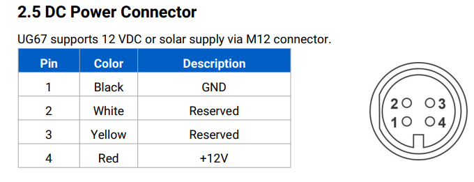

<p align="center"></p>
<h1 align="center"> LoRaWAN Gateway </h1> 
<h4 align="right">Month 24</h4>


<br>

# Table of contents
- [Table of contents](#table-of-contents)
- [Por que los Gateway LoraWAN usan el protocolo "Semtech UDP Packet Forwarder" para conectarse a los servicio Clouds?](#por-que-los-gateway-lorawan-usan-el-protocolo-semtech-udp-packet-forwarder-para-conectarse-a-los-servicio-clouds)
- [DRAGINO DLOS8N Outdoor LoRaWAN Gateway Setting](#dragino-dlos8n-outdoor-lorawan-gateway-setting)
  - [Typical Network Setup](#typical-network-setup)
  - [Ethernet conection](#ethernet-conection)
  - [DLOS8N Setting](#dlos8n-setting)
  - [Access the Internet as a WiFi Client](#access-the-internet-as-a-wifi-client)
  - [4G setting](#4g-setting)
  - [Frequency LoRa Chile](#frequency-lora-chile)
  - [Configure DLOS8N to connect to TTN v3](#configure-dlos8n-to-connect-to-ttn-v3)
  - [if all is ok!](#if-all-is-ok)
  - [LED Indicators](#led-indicators)
- [UG67 Milesight Outdoor LoRaWAN Gateway Setting](#ug67-milesight-outdoor-lorawan-gateway-setting)
  - [Wireless Access](#wireless-access)
  - [Wired Access](#wired-access)
  - [GUI](#gui)
    - [Milesight LoRaWAN Gateway ](#milesight-lorawan-gateway-)
  - [Eth0 Setting](#eth0-setting)
  - [WiFi Setting](#wifi-setting)
  - [LED Indicators](#led-indicators-1)
  - [Power Externa](#power-externa)
  - [Reset](#reset)
  - [Leds \& Reset](#leds--reset)
  - [Setting Gateway](#setting-gateway)
  - [EUI Gateway](#eui-gateway)
  - [Troubleshooting](#troubleshooting)

<br>

# Por que los Gateway LoraWAN usan el protocolo "Semtech UDP Packet Forwarder" para conectarse a los servicio Clouds?
Es un protocolo antiguo y ligero, desarrollado originalmente por Semtech, para enviar datos LoRa a un Network Server, como TTN (The Things Network) o ChirpStack.
Es un software que corre en el gateway y se encarga de:

* 📨 Recibir los paquetes LoRa desde los nodos (uplinks).
* 🌐 Enviar esos paquetes por UDP a un servidor central (Network Server).
* 📥 Recibir downlinks desde el servidor, y transmitirlos por LoRa.

Este sistema utiliza un protocolo binario sobre UDP, sin encriptación, sin autenticación avanzada, y sin compresión. NO es muy seguro por eso hay otras versiones como:
* Basic Station (de Semtech)
* LoRa Basics™ Station (con WebSockets, TLS, multifuncional)
* ChirpStack UDP Forwarder (más flexible)

# DRAGINO DLOS8N Outdoor LoRaWAN Gateway Setting
Quick Start Guide
<p align="center"></p>

info: http://wiki.dragino.com/xwiki/bin/view/Main/User%20Manual%20for%20All%20Gateway%20models/DLOS8N/

## Typical Network Setup
```Wifi AP:```<br>
name: dragino-27cbec <br>
password: dragino+dragino

```Browser IP``` <br> 
10.130.1.1

```Router Access```<br>
Nombre de usuario: root <br>
Contraseña: dragino

## Ethernet conection

```Eth0 PC setting``` <br>
IP: 172.31.255.253 <br>
Netmask: 255.255.255.252

```Browser IP``` <br>
172.31.255.254:8000

```Router Access```<br>
Nombre de usuario: root <br>
Contraseña: dragino

info: http://wiki.dragino.com/xwiki/bin/view/Main/User%20Manual%20for%20All%20Gateway%20models/DLOS8N/#H11.3IconfiguredDLOS8NforWiFiaccessandlostitsIP.Whattodonow3F

## DLOS8N Setting 
frecuencia: 915/920/923/ EC25-aux

## Access the Internet as a WiFi Client
```path: Network/Wifi/WiFi WAN Client Settings``` <br>
Habilitar (Enable WiFi WAN Client) <br>
Usar (WiFi Survey) para elegir Red WiFi <br>
Usar (Passphrase) para colocar password red

<p align="center"></p>
<br>

## 4G setting
```path: Network/Celular``` <br>
Test SIM card Movistar: <br>
APN: wap.tmovil.cl  <br>
usuario: wap <br>
contraseña: wap <br>
Pin:1234 default <br>

> :bulb: **Tip:** Marca *303# en tu celular Movistar Prepago o con Plan Controlado y accede a múltiples opciones

<p align="center"></p>


<br>

<p align="center"></p>

> :warning: **Warning:**  al PARECER, cuando estamos conectados al wifi del dragino desde el computador, no obtenemos internet desde el 4G

<br>

## Frequency LoRa Chile

```path: LoRa/Radio Settings``` <br>
keep Alive Period (sec): 120 <br>
Frequency Plan: AU915 Australia 915Mhz (915-928) <br>
Frecuency Sub Band: 2:AU915,FSB2 (916.8-918.2)

<p align="center"></p>
<br>

## Configure DLOS8N to connect to TTN v3

```path: LoRaWan/LoRaWAN-Semtech UDP/LoRaWAN Configuration/Primary LoRaWAN Server``` <br>
Service Provider: Custom / Private LoRaWAN <br>
Server Address: xxxxxxxxx.nam1.cloud.thethings.industries (este dato se obtiene después de crear el server en el TTN)<br>
Uplink : 1700 <br>
Downlink: 1700

<p align="center"></p>
<br>

Note: The server address must match the Gateway server address you choose in TTN V3.

## if all is ok!

<p align="center"></p>

In TTN v3 portal, we can also see the gateway is connected.

## LED Indicators
* SOLID GREEN: DLOS8N is alive with LoRaWAN server connection.

* BLINKING GREEN:Device has internet connection but no LoRaWAN Connection  or Device is in booting stage, in this stage, it will BLINKING GREEN for several seconds and then RED and YELLOW will blink together.

* SOLID RED: Device doesn't have Internet connection.

<br>

<br>

# UG67 Milesight Outdoor LoRaWAN Gateway Setting
Quick Start Guide
<p align="center"></p>

info: https://resource.milesight.com/milesight/iot/document/ug67-user-guide-en.pdf <br>
info: https://resource.milesight-iot.com/document/UG67%20Quick%20Guide%20V1.1.pdf

##  Wireless Access
Access Point: ```192.168.1.1``` <br>
ssid: ```Gateway_******``` <br>
pass: ```iotpassword``` <br>


Gateway GUI Wifi Address: ```192.168.1.1``` 

## Wired Access 

IP gateway: ```192.168.23.150``` <br>

PC Setting (Cliente) <br>
IP Address:       ```192.168.23.200``` <br>
SubNet Mask:      ```255.255.255.0``` <br>
Default gateway:  ```192.168.23.150``` <br>
Preferred DNS server: ```8.8.8.8``` <br>

Gateway GUI ETH Address: ```192.168.23.150``` <br>

## GUI
### Milesight LoRaWAN Gateway <br>
Username: ```admin``` <br>
Password: ```password``` <br>
<p align="center"></p>

## Eth0 Setting
Alimentado por Eth0/PPPoE
<p align="center"></p>

## WiFi Setting
<p align="center"></p>


## LED Indicators

| LED       | Status        Description                              |
|-----------|---------------------------------------------------------|
|   `SYS`   | `Green Light`  Static: the system is running properly    |
|   `SYS`   | `Red Light`    The system goes wrong                     |
|   `LoRa`  | `Green Light`  Packet Forwarder mode is running well     |
|   `LoRa`  | `Off`          Packet Forwarder mode is running off      |
|   `LTE`   | `Off`          SIM card is registering or fails to register (or there are no SIM cards inserted)     |
|   `LTE`   | `Green Light`  See Manual                                |

## Power Externa
<p align="center"></p>

## Reset
<p align="center"></p>

## Leds & Reset
<p align="center"></p>


<br>


## Setting Gateway

1. ```Setting WiFi``` <br>
Menu/Network/Interface/<br>
Opciones para configurar internet: <br>
```Port``` configurar internet **DHCP** por el Eth0 <br>
```Wlan``` desactivar el AP y configurar internet en Modo cliente buscando una Red (no funciona SCAN WiFi conectado al gateway en AP) <br>
* Go to ```Network``` → ```Interface``` → ```WLAN``` and select ```Client``` mode. 
* Click ```Scan``` to search for Wi-Fi access point. Select the available one and click ```Join Network```
* Type the key of Wi-Fi.
* ip config/protocol DHCP Client.
* Go to ```Status```→ ```WLAN``` to check Wi-Fi status. If it shows ```Connected```, it means gateway connectstoWi-Fi successfully.

2. ```Disable Default Server``` <br>
In the left menu, choose Packet Forwarder/General.  hay que desabilitar el "Embedded NS"

3. ```Connect Milesight UG67 with UDP Packet Forwarder``` <br>
En  Mult-Destination crear un nuevo server y Habilitar (In the Packet Forwarder menu and General tab, click the little + button to create a new server)<br>
Type: ```Semtech``` <br>
Server Address: custom → ```xxxxx.nam1.cloud.thethings.indutries``` <br>
Port UP: ```1700``` <br>
Port Down: ```1700``` <br>

<p align="center"></p>

> :memo: **Note:** For the Server Address choose custom, and enter the address of The Things Stack deployment you are using

4. ```Check the LoRawan radio frequency ```
Packet Forwarder/Radios/Radio Channel Setting/ <br>
Sopppoted Freq → AU915

5. ```Add EUI Gateway in The Thing Stack (TTN) o Cloud Plataforme Lorawan server```

<br>

## EUI Gateway
<p align="center"></p>


<br>


## Troubleshooting
* Si el Led LoRa esta apagado, o no es posible conectarse via Ethernet es recomendable reset gateway.
* Si no conecta a internet conectado desde el Eth0 verificar que el **DHCP** este habilitado en ese puerto
       
<br>

---
Copyright &copy; 2022 [carjavi](https://github.com/carjavi). <br>
```www.instintodigital.net``` <br>
carjavi@hotmail.com <br>
<p align="center">
    <a href="https://instintodigital.net/" target="_blank"></a>
</p>


